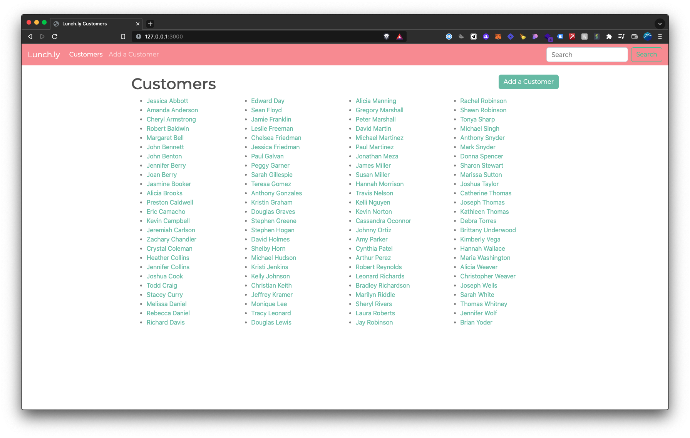
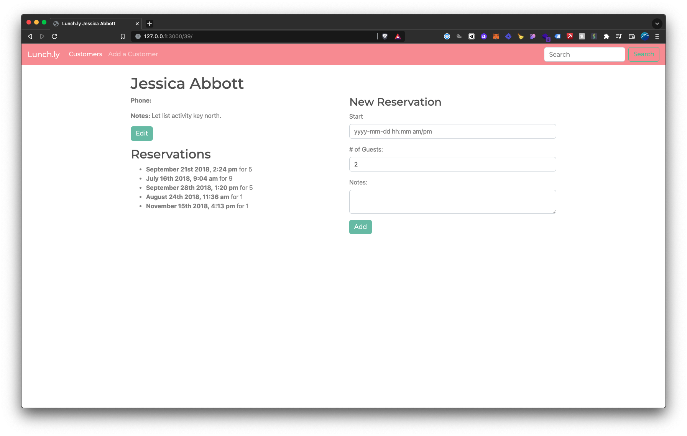
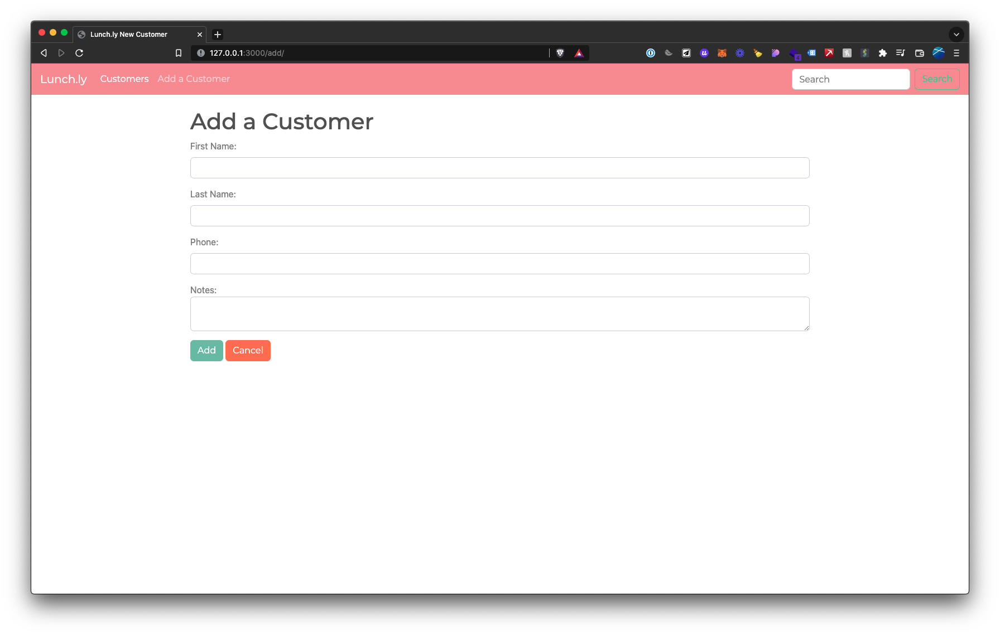
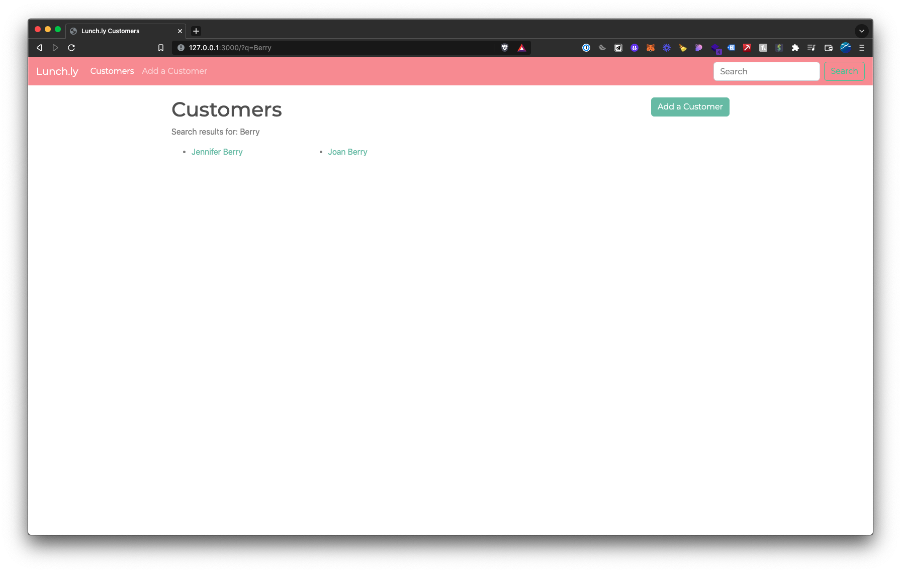
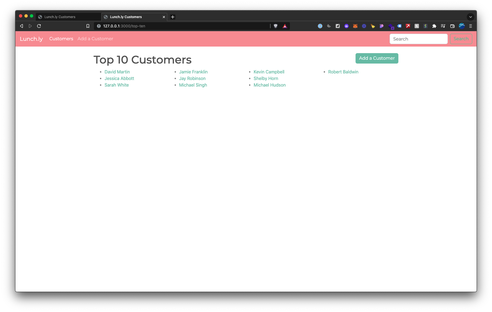

# Lunchly App

## Table of Contents
- [Installation and Setup](#installation-and-setup)
    - [Install packages](#install-packages)
    - [Start your local database server](#start-your-local-database-server)
    - [Create databases](#create-databases)
- [Using the app](#using-the-app)
    - [Start local app server](#start-local-app-server)
    - [View all customers](#view-all-customers)
    - [View a single customer](#view-a-single-customer)
- [Running Tests](#running-tests)
    - [Test Coverage](#test-coverage)

## Installation and Setup

### Install packages

Run `npm install` to install all dependencies.

### Start your local database server

Start your local database server.
You'll create 2 new databases for this app -- one for production, one for testing.

### Create databases

_For production:_
Create a database named `lunchly`, then seed the data from `data.sql`:

```console
$ createdb lunchly
$ psql < data.sql
```

_For testing:_
Create a database named `lunchly_test`, then seed the data from `data_test.sql`:

```console
$ createdb lunchly_test
$ psql < data_test.sql
```

## Using the app

### Start local app server

To start the app server, run the following command:

```console
$ nodemon server
```

This will run the app on your localhost:
```
http://127.0.0.1:3000/
```

### View all customers

To view all customers, visit the main index page. This will show all customers in the database.


### View a single customer

To view a single customer, click on the customer's name.
You'll then view all the customer's details, edit notes about the customer, view all their reservations, and set new reservations:


### Add a customer

To add a customer, click on "Add a Customer" in the top menu.


### Search for a customer

To search for a customer, type in the search query in the menu bar.
This will search for matching keywords in the character's first or last name.


### View Top 10 Customers

This page shows the top 10 customers by number or reservations.
To visit the page, click on "Top 10 Customers" or visit this page:
```console
http://127.0.0.1:3000/top-ten
```




# Running Tests

Test files are found in the `__tests__` folder.

To run tests, run the following command:
```console
$ jest
```

This will run all test files in the `__tests__` folder.

## Test Coverage

To check test coverage, run the following command:
```console
$ jest --coverage
```

# Roadmap
Items that I would like to implement in the future:
- Delete customer
- Delete reservations
- 